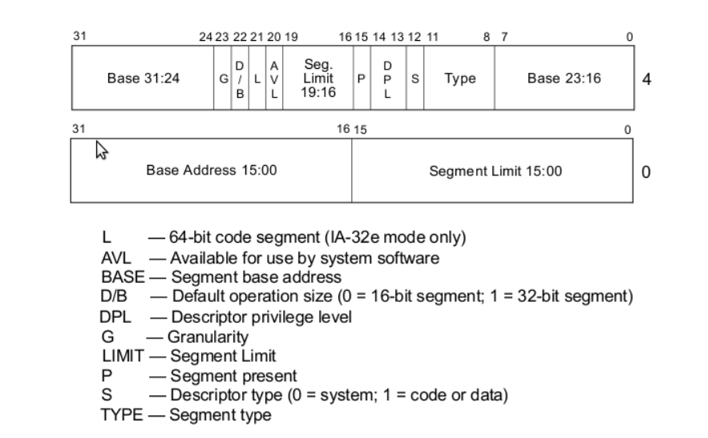

## Introduction
The simplest workable configuration of segment registers is described by Intel as the **basic flat model**. In this model:  
- Two overlapping segments are defined that cover the full 4 GB of addressable memory.
  - One segment is for **code**.
  - The other is for **data**.  

These overlapping segments mean there is no attempt to protect one segment from the other. This approach keeps things simple early on, especially since we can later modify the segment descriptors more easily after switching to a higher-level language.

## Null Descriptor
The CPU requires that the first entry in the **Global Descriptor Table (GDT)** purposely be an invalid **null descriptor**.  

### Purpose
- **Error Handling:** The null descriptor helps catch mistakes where a segment register is accidentally set to `0x0` before accessing an address.
- If an addressing attempt is made with the null descriptor, the CPU will raise an exception.

---

---

## Code Segment Configuration
The **code segment** in the flat model is configured as follows:  

- **Base:** `0x0`  
- **Limit:** `0xfffff`  
- **Present:** `1` (segment is present in memory - used for virtual memory).  
- **Privilege:** `0` (ring 0 is the highest privilege).  
- **Descriptor Type:** `1` (1 for code or data segment, 0 for traps).  
- **Type:**  
  - **Code:** `1` (indicates this is a code segment).  
  - **Conforming:** `0` (non-conforming means code in a segment with a lower privilege may not call code in this segment - key for memory protection).  
  - **Readable:** `1` (allows reading constants defined in the code).  
  - **Accessed:** `0` (used for debugging and virtual memory techniques; the CPU sets this bit when accessing the segment).  

### Other Flags
- **Granularity:** `1`  
  - Multiplies the limit by 4 KB (shifts 3 hex digits left).  
  - Expands the segment limit from `0xfffff` to `0xfffff000`, covering 4 GB of memory.  
- **32-bit Default:** `1`  
  - The segment will hold 32-bit code.  
  - Sets the default data unit size for operations (e.g., `push 0x4` expands to a 32-bit number).  
- **64-bit Code Segment:** `0` (unused on 32-bit processors).  
- **AVL (Available for Use):** `0`  
  - Can be used for debugging or other purposes, but is not used here.

---

## Data Segment Configuration
Since we are using a simple flat model, the **data segment** is identical to the code segment, except for the following **type flags**:  

- **Code:** `0` (indicates this is a data segment).  
- **Expand Down:** `0`  
  - Allows the segment to expand down (TODO: explain this).  
- **Writable:** `1`  
  - Allows the data segment to be written to; otherwise, it would be read-only.  
- **Accessed:** `0`  
  - Often used for debugging and virtual memory techniques; the CPU sets this bit when it accesses the segment.

---

